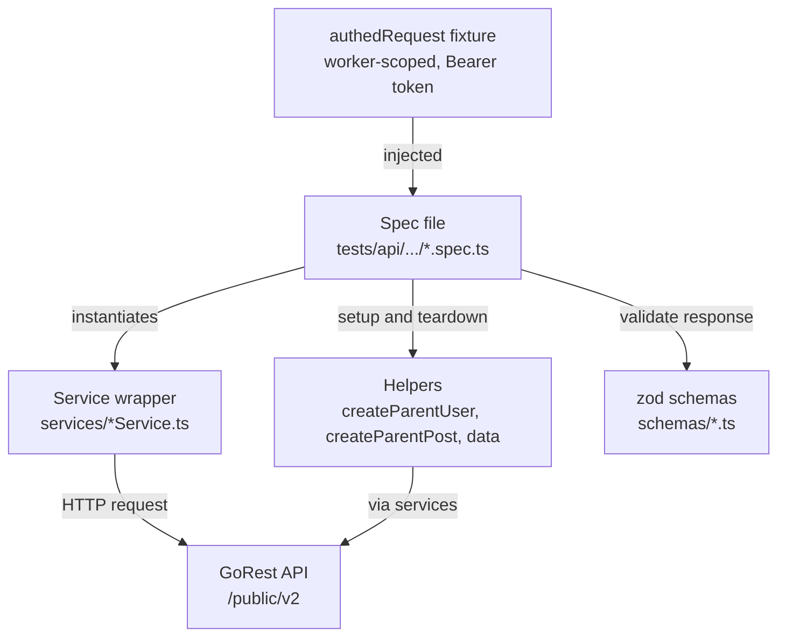

# GoRest API Tests

[](https://github.com/LyuboPetrov94/gorest-api-tests/actions/workflows/ci.yml)

API testing framework for the [GoRest](https://gorest.co.in/) sandbox REST API, built with [Playwright](https://playwright.dev/) and TypeScript. Continuation of patterns developed in a prior UI + API testing framework, applied to a Bearer-token-authenticated API with per-token data isolation.

## Status

**Complete - 195 test cases, all green.** All four standard resources are covered end-to-end (CRUD, validation, security, plus a zod schema demonstration on Users), and all three GoRest-specific sandbox bonus specs are done. See [TEST_PLAN.md](TEST_PLAN.md) for the live coverage matrix and [Notable Patterns](#notable-patterns) for the highlights.

### Coverage

| Resource | CRUD | Validation | Security | Schema | Total |
|----------|-----:|-----------:|---------:|-------:|------:|
| Users    | 8  | 16 | 11 | 4 | 39 |
| Posts    | 11 | 19 | 13 | - | 43 |
| Comments | 11 | 23 | 13 | - | 47 |
| Todos    | 15 | 19 | 13 | - | 47 |
| **Subtotal** | **45** | **77** | **50** | **4** | **176** |

Bonus sandbox specs (GoRest-specific capabilities): **force-status** 10 · **delay** 6 · **rate-limit** 3 = **19**.

**Grand total: 195 TCs.**

## Why GoRest

GoRest is unusually well-suited for portfolio-grade API testing demonstrations:

- **Per-token data isolation** - records created by one access token are invisible to others, so tests never collide with other consumers of the public sandbox
- **Real Bearer-token authentication** - enforced server-side, returning a proper `401` on bad/missing credentials (and `404` on per-token-isolated resources), suitable for genuine auth-gate negative tests
- **Built-in error and latency simulation** - `?force_status=N` and `?delay=N` query parameters specifically designed for testing error-path handling
- **Testable rate limiting** - 300 requests/min default (continuously-refilling token bucket, ~5 req/sec) with `X-RateLimit-*` response headers, supports demonstrating 429 handling
- **24-hour auto-reseed** - predictable state cycle, leaked records self-clean

## Tech Stack

- **Playwright** v1.60 - test runner, API request context
- **TypeScript** 6.x - strict mode
- **zod** v4.x - runtime response schema validation (used in one demonstration spec)
- **dotenv** - loads `GOREST_TOKEN` from `.env` at config-load time
- **Node.js** 22+ (current maintenance LTS; Node 20 reached end-of-life in 2026)
- **ESLint** 10 (flat config) with **typescript-eslint** + **eslint-plugin-playwright**, plus **Prettier** for formatting

## What This Demonstrates

- **Service-wrapper pattern** - endpoints and HTTP verbs encapsulated in `services/<Resource>Service.ts`; specs never touch raw paths
- **Worker-scoped authenticated request fixture** - `authedRequest` injects the Bearer token once per worker; tests reuse the context
- **ISTQB test design applied per resource** - equivalence partitioning, 3-point boundary value analysis, decision tables, and state-transition coverage
- **Auth-gate negative coverage** - both EP classes on every authed write verb (no token vs. invalid token - GoRest returns distinct responses for each)
- **Runtime schema validation** with strict-mode `zod` - a demonstration spec on `POST /users`, reused across GET-by-id and the list endpoint, with a negative-of-schema unit test
- **Fault-injection / resilience testing** - the sandbox specs exercise forced error statuses (`?force_status`), slow responses (`?delay`, with a BVA on the 5 s cap), and real rate-limit `429` enforcement via a concurrent burst
- **Per-subtree documentation** - `tests/api/CLAUDE.md` carries API-specific conventions, the locked design decisions, and an empirically-built gotcha catalogue

## Project Structure

```
gorest-api-tests/
├── tests/
│   └── api/
│       ├── CLAUDE.md          # API conventions, the 5 locked decisions, gotcha catalogue
│       ├── users/             # crud · validation · security · schema
│       ├── posts/             # crud · validation · security
│       ├── comments/          # crud · validation · security
│       ├── todos/             # crud · validation · security
│       └── sandbox/           # force-status · delay · rate-limit (GoRest-specific)
├── services/                  # Service wrappers - one class per resource + SandboxService
├── schemas/
│   └── UserSchemas.ts         # zod response-shape schemas (Users demonstration)
├── fixtures/
│   └── index.ts               # authedRequest (worker-scoped Bearer-token APIRequestContext)
├── helpers/
│   ├── data.ts                # randomEmail, randomName, randomString
│   ├── createParentUser.ts    # { id, cleanup } for nested-resource setup
│   └── createParentPost.ts    # { postId, cleanup } - chains createParentUser -> post
├── playwright.config.ts       # Single `api` project; baseURL is origin-only (https://gorest.co.in)
├── tsconfig.json
├── eslint.config.js           # ESLint flat config (TypeScript + Playwright rules)
├── .prettierrc                # Prettier formatting options
├── .prettierignore            # Prettier excludes (build output + docs)
├── .env.example               # Template - copy to .env and fill GOREST_TOKEN
├── .github/
│   └── workflows/
│       └── ci.yml             # GitHub Actions - typecheck + API suite + advisory rate-limit job
├── .gitignore                 # .env, node_modules, test-results, playwright-report
├── CLAUDE.md                  # Project conventions (root)
└── README.md                  # This file
```

> **Note on `baseURL`:** it is the origin only (`https://gorest.co.in`); each service carries the full `/public/v2/<resource>` path. Putting `/public/v2` in `baseURL` would break WHATWG URL resolution - request paths starting with `/` replace the base path rather than appending to it. See the gotcha catalogue in [`tests/api/CLAUDE.md`](tests/api/CLAUDE.md).

## Getting Started

### Prerequisites

- Node.js 22 or higher
- npm
- A GoRest access token - see step 2 below

### Setup

```bash
# 1. Install dependencies
npm install

# 2. Get a GoRest access token
#    Sign in at https://gorest.co.in/ with GitHub / Google / Microsoft.
#    Generate a personal access token from the account dashboard
#    (Account -> Access Tokens).

# 3. Configure your token
cp .env.example .env
#    Edit .env and set GOREST_TOKEN=<your-token>
#    .env is gitignored - never commit your actual token.
```

### Verify the setup

```bash
npm run typecheck     # tsc --noEmit; should report no errors
npm run lint          # ESLint - code quality
npm run format:check  # Prettier - formatting check (run `npm run format` to fix)
```

## Running Tests

```bash
# All tests EXCEPT the rate-limit burst (excludes the @ratelimit tag)
npm test

# API specs only (single `api` project, no browser needed) - also excludes @ratelimit
npm run test:api

# ONLY the rate-limit burst (rate-limit.spec.ts TC03) - run in isolation
npm run test:ratelimit

# Specific resource
npx playwright test tests/api/users

# Debug mode
npm run test:debug

# HTML report after a run
npm run report
```

The `@ratelimit`-tagged burst fires ~400 concurrent authed requests to deplete the per-token 300/min bucket and prove `429` enforcement, so it is excluded from the default run (it would otherwise starve other authed specs' budget). Run it alone via `npm run test:ratelimit`, and let the bucket recover (~60 s) before running the authed suite again.

### Parallelism notes

GoRest's default token rate limit is **300 requests/minute** (a continuously-refilling token bucket at ~5 req/sec, not a hard fixed window - so steady low-rate traffic effectively never depletes it; bursts can). `playwright.config.ts` defaults to 2 workers locally and 1 on CI, which stays comfortably under the limit. If your token has a raised rate limit, increase `workers` in the config. If you hit unexpected 429s, lower it.

## Continuous Integration

A GitHub Actions workflow ([`.github/workflows/ci.yml`](.github/workflows/ci.yml)) runs on every push to `master`, on every pull request, and on manual dispatch:

- **`lint` job** - runs ESLint and a Prettier formatting check; needs no token, so it runs in parallel with the suite.
- **`test` job** - `npm ci` -> `npm run typecheck` -> `npm run test:api` (the full suite minus the `@ratelimit` burst). The `list` reporter prints one line per test to the step log, so every test conducted is visible directly in the run, and a per-run results table (passed / failed / flaky / skipped) is written to the run's **Summary** tab. The Playwright HTML report is uploaded as a build artifact on **every** run (pass or fail), retained 30 days. No browser binaries are installed: the API request context talks HTTP directly and needs none, so runs stay fast.
- **`rate-limit` job** - runs *after* `test` (`needs: test`) with a ~60 s cooldown so the token's 300/min bucket can refill before the burst deliberately drains it. It is **advisory** (`continue-on-error`): a missed `429` reflects the token's real-time bucket state, not a code defect, so it reports status without failing the build.
- **`deploy-report` job** - on pushes to `master` only, publishes the HTML report to **GitHub Pages** so the latest run's report is viewable at a live URL (no artifact download needed).

`workers` is pinned to 1 on CI (via `process.env.CI` in `playwright.config.ts`) to stay under the rate limit, and a `concurrency` guard cancels superseded runs so two runs never draw down the same token at once.

**Required setup:**

1. Add your token as a repository secret named `GOREST_TOKEN` (Settings -> Secrets and variables -> Actions -> New repository secret). The `authedRequest` fixture throws at load time if it is missing, so CI fails loudly with a clear message rather than emitting silent 401s.
2. For the published report, enable GitHub Pages with Settings -> Pages -> Build and deployment -> Source: **GitHub Actions**. Until then the `deploy-report` job will fail; the `test` job is unaffected.

## API Call Budget

Total HTTP requests a full green run issues to GoRest, by spec. Updated as specs are added or changed.

| Resource | Spec | API calls |
|----------|------|----------:|
| Users | `users-crud.spec.ts` | 18 |
| Users | `users-validation.spec.ts` | 26 |
| Users | `users-security.spec.ts` | 13 |
| Users | `users-schema.spec.ts` | 6 |
| Posts | `posts-crud.spec.ts` | 30 |
| Posts | `posts-validation.spec.ts` | 39 |
| Posts | `posts-security.spec.ts` | 17 |
| Comments | `comments-crud.spec.ts` | 32 |
| Comments | `comments-validation.spec.ts` | 45 |
| Comments | `comments-security.spec.ts` | 18 |
| Todos | `todos-crud.spec.ts` | 47 |
| Todos | `todos-validation.spec.ts` | 41 |
| Todos | `todos-security.spec.ts` | 17 |
| Sandbox | `force-status.spec.ts` | 10 |
| Sandbox | `delay.spec.ts` | 6 |
| Sandbox | `rate-limit.spec.ts` | 2 |
| | **Total** | **367** |

Per-resource subtotals: Users **63**, Posts **86**, Comments **95**, Todos **105**, Sandbox **18**.

The `rate-limit.spec.ts` count (**2**) covers only TC01 (authed) + TC02 (anon), which run in the default suite. Its TC03 burst is **excluded from the default run** (tagged `@ratelimit`) and issues **~400 additional authed requests** when run in isolation via `npm run test:ratelimit` - by design depleting the token's minute budget to provoke a real `429`. That ~400 is not part of the 367 default-suite total.

**Rate-limit relevance:** GoRest's 300 req/min limit is **per access token**, so not every call above counts against your configured token. Of the 367 total, **30 are anonymous** (no `Authorization` header) and **27 use a deliberately-invalid bogus token** (`deadbeef`) - concentrated in the security specs' auth-gate negatives, the anonymous `GET` list in each CRUD spec, and the anonymous `force_status` / `delay` / rate-limit TCs in the sandbox specs. Neither group draws down the `.env` token's budget (anonymous carries no token; the bogus token is a different, invalid identity rejected at validation). So only **~310** requests count toward the token's 300/min - and spread across a run lasting well over a minute, with the bucket continuously refilling, a normal run never approaches the ceiling. (The `@ratelimit` burst is the deliberate exception, isolated out of the default run for exactly this reason.)

**What's counted (in the 367 total):** every real HTTP request to GoRest - test-body requests, file-scope `beforeAll`/`afterAll` setup and teardown, `afterEach` cleanup `DELETE`s (including the second `DELETE` in idempotency/state-transition TCs, which returns 404 but is still a call), and parent-helper calls (`createParentUser` = 1 POST + 1 DELETE; `createParentPost` = 2 POSTs + 1 DELETE). Anonymous and bogus-token requests count too (they hit the server, returning 200/401/404). `newContext()` / `dispose()` are *not* counted - they create/close a client context without issuing a request.

**Assumptions:** a green run (config `retries: 1` only fires on failure), counted at `workers: 1`. Under parallel workers the file-scope `beforeAll`/`afterAll` hooks can run once per worker that picks up tests from a file, nudging the real total slightly higher.

## Architecture



A spec receives the worker-scoped `authedRequest` context from the fixture, hands it to a service wrapper (which owns the endpoint paths and verbs), and asserts on the response - optionally validating its shape against a zod schema. Helpers build parent resources for nested-resource setup. The spec itself never touches a raw URL or the Bearer token.

### Service Wrappers

Each GoRest resource gets a corresponding class in `services/` (the API equivalent of a Page Object Model): `UsersService`, `PostsService`, `CommentsService`, `TodosService`, plus `SandboxService` for the `?force_status` / `?delay` / rate-limit features. Services own endpoint paths and HTTP verbs; specs only see methods. Conventions and design rules live in [`tests/api/CLAUDE.md`](tests/api/CLAUDE.md).

### Fixtures

`fixtures/index.ts` exposes:

- **`authedRequest`** - worker-scoped `APIRequestContext` pre-loaded with `Authorization: Bearer ${GOREST_TOKEN}`. Token is loaded from `.env` at config-load time; fixture fails loudly at module load if it's missing.

### Helpers

- **`helpers/data.ts`** - randomized data generators (`randomEmail`, `randomName`, `randomString`)
- **`helpers/createParentUser.ts`** / **`createParentPost.ts`** - return `{ id, cleanup }` / `{ postId, cleanup }` closures for nested-resource setup; the cleanup closure cascade-deletes the whole subtree (per-token isolation makes this reliable)

### Schemas

`schemas/UserSchemas.ts` holds the zod schemas (`UserSchema`, `UserListSchema`) used by the `users-schema` demonstration spec - validated on `POST /users` and reused across GET-by-id and the list endpoint, not retrofitted across every assertion. Strict-mode (`.strict()`) catches "server added a field" regressions that `toMatchObject` cannot, and a negative-of-schema unit test guards against an accidentally-permissive schema.

## Test Design Techniques

Tests apply ISTQB techniques:

- **Equivalence Partitioning** - one test per valid/invalid input class
- **Boundary Value Analysis (3-point)** - below, at, and above limits; all three points kept even when "at" and "above" produce identical outcomes (boundary shape, not just outcome diversity)
- **Decision Table** - multi-input combinations mapped to expected outcomes
- **State Transition** - multi-step flows covering valid and invalid transitions

## Notable Patterns

Highlights worth a look, each linked to the spec that demonstrates it:

| Pattern | Where to see it |
|---------|-----------------|
| Per-token data isolation as a security property - anonymous writes on `/{id}` return `404` (not `401`) because the resource is invisible, not because of a classic auth gate | [users-security.spec.ts](tests/api/users/users-security.spec.ts) |
| Two distinct auth-gate EP classes - no-token (`"Authentication failed"`) vs. invalid-token (`"Invalid token"`), pinned separately on every write verb | [posts-security.spec.ts](tests/api/posts/posts-security.spec.ts) |
| Parameterised write-verb loop - one closure table drives the PUT/PATCH/DELETE auth-gate negatives without duplication | [users-security.spec.ts](tests/api/users/users-security.spec.ts) |
| 5-point boundary value analysis on length bounds - both bounds, keeping points whose outcomes converge to document the boundary's shape | [posts-validation.spec.ts](tests/api/posts/posts-validation.spec.ts) |
| Validation-error aggregation with set-semantic assertions - asserts the set of error fields, never their order (no coupling to model declaration order) | [users-validation.spec.ts](tests/api/users/users-validation.spec.ts) |
| State-transition coverage - `status` `pending` <-> `completed` both edges, plus DELETE idempotency (`exists -> deleted -> still-deleted`) | [todos-crud.spec.ts](tests/api/todos/todos-crud.spec.ts) |
| Server-side timezone normalization pinned - `due_on` converted to IST (`+05:30`), asserted literally so a server TZ change fails loudly | [todos-validation.spec.ts](tests/api/todos/todos-validation.spec.ts) |
| Runtime schema validation - strict `zod` schema reused across endpoints + a negative-of-schema unit test | [users-schema.spec.ts](tests/api/users/users-schema.spec.ts) |
| Fault injection via `?force_status` - one EP class across all endpoints/verbs (cross-cutting middleware), so it is covered once on a carrier endpoint | [force-status.spec.ts](tests/api/sandbox/force-status.spec.ts) |
| Slow-response handling with a BVA on the 5 s `?delay` cap - including the above-cap clamp | [delay.spec.ts](tests/api/sandbox/delay.spec.ts) |
| Real rate-limit `429` via a concurrent burst, isolated from the default run so it doesn't drain the shared budget | [rate-limit.spec.ts](tests/api/sandbox/rate-limit.spec.ts) |
| Nested-resource lifecycle - parent helpers + cascade-delete cleanup (deleting the user reaps its posts/comments) | [comments-crud.spec.ts](tests/api/comments/comments-crud.spec.ts) |

## Documentation Map

| File | What's in it |
|------|--------------|
| [`README.md`](README.md) | This file - overview, scope, getting started |
| [`TEST_PLAN.md`](TEST_PLAN.md) | Coverage matrix - TC counts per resource and per sandbox spec |
| [`CLAUDE.md`](CLAUDE.md) | Project-wide conventions and the inspect-and-approve workflow rules |
| [`tests/api/CLAUDE.md`](tests/api/CLAUDE.md) | API conventions, the 5 locked project-specific decisions, schema-validation discipline, gotcha catalogue (fills empirically) |
